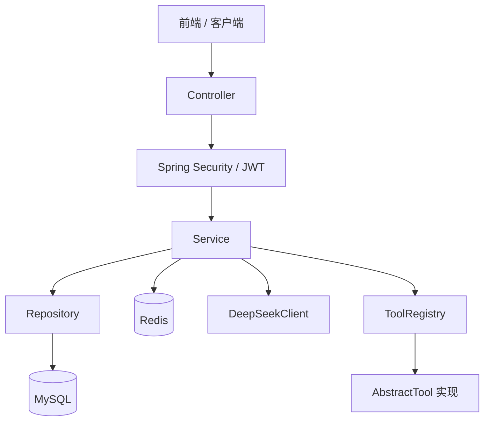
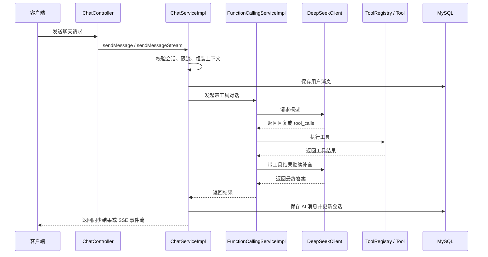
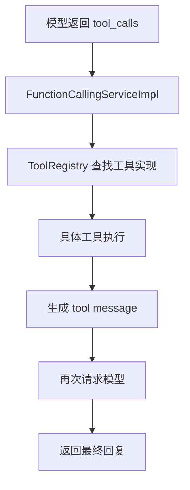

# 智能问答Agent系统

> 基于 `Spring Boot 3` 的智能问答 Agent 后端，支持 `JWT` 认证、会话管理、同步聊天、`SSE` 流式响应、`Function Calling` 与工具调用。

## 文档导航

- 文档总入口：`docs/README.md`
- 需求基线：`docs/02-requirements/需求规格说明书.md`
- 架构基线：`docs/03-architecture/系统架构设计.md`
- 数据库设计：`docs/03-architecture/数据库设计.md`
- 接口基线：`docs/04-api/API接口定义文档.md`
- 运维检查：`docs/05-operations/环境配置检查清单.md`

## 项目简介

这是一个围绕“认证 -> 会话/消息 -> 大模型调用 -> 工具执行 -> 回复持久化 -> 返回客户端”主链路构建的后端项目。

当前代码已经实现：

- 基于 `Spring Security + JWT` 的登录认证、登出与刷新机制
- 会话创建、分页、详情查询与删除
- 同步聊天与 `SSE` 流式聊天
- 基于 `DeepSeek` 的 `Function Calling`
- 工具注册、数据库配置加载与工具执行
- Redis 限流、登录状态辅助控制与 Token 黑名单支持

## 项目信息

| 项目 | 说明 |
|------|------|
| **项目名称** | Intelligent QA Agent |
| **项目路径** | `D:\IdeaCode\intelligent-qa-agent` |
| **后端技术栈** | Java 17 + Spring Boot 3.4.x |
| **主要能力** | 认证、对话、流式响应、Function Calling、工具执行 |

## 技术栈

| 技术 | 版本 | 说明 |
|------|------|------|
| Java | 17 | 编程语言 |
| Spring Boot | 3.4.4 | 核心框架 |
| Spring Security | 6.x | 安全认证 |
| MyBatis-Plus | 3.5.5 | ORM 框架 |
| MySQL | 8.0+ | 关系型数据库 |
| Redis | 7.x | 缓存、限流、状态辅助 |
| Spring WebFlux | - | WebClient 与流式能力 |
| SseEmitter | - | SSE 流式响应 |
| JWT | 0.12.5 | Token 认证 |
| SpringDoc OpenAPI | 2.8.6 | API 文档 |
| Hutool | 5.8.25 | 工具库 |

## 核心功能

### 认证模块

- 用户注册、登录、登出
- Access Token / Refresh Token
- 登录失败次数限制
- Token 黑名单
- 用户信息获取与密码修改
- 登录日志记录

### 对话模块

- 会话创建、分页、详情、删除
- 同步聊天
- `SSE` 流式聊天
- 多轮上下文管理
- 会话标题生成
- Token 用量记录

### Function Calling 模块

- 向模型传入工具定义
- 解析 `tool_calls`
- 执行本地工具
- 将工具执行结果继续回传模型补全最终答案

### 工具模块

当前代码中的工具实现包括：

- `WeatherTool`：天气查询
- `WebSearchTool`：网页搜索
- `TranslatorTool`：翻译
- `TimeTool`：时间查询
- `CalculatorTool`：计算器

## 系统架构



### 分层说明

- `controller`：HTTP 入口、参数接收、结果返回
- `service`：业务编排、聊天流程、Function Calling、工具执行
- `repository`：基于 `MyBatis-Plus` 的数据访问
- `client`：第三方模型服务调用封装
- `tool`：工具抽象、工具注册、工具实现
- `security`：JWT 认证过滤与令牌处理

## 核心流程

### 聊天主流程



### 工具调用流程



## 项目结构

```text
intelligent-qa-agent/
├── docs/                              # 项目文档
├── sql/                               # SQL 脚本
├── src/main/java/com/jujiu/agent/
│   ├── AgentApplication.java          # 启动类
│   ├── client/                        # DeepSeek 客户端封装
│   ├── common/                        # 公共结果与异常
│   ├── config/                        # 配置类
│   ├── controller/                    # 控制器
│   ├── model/                         # DTO / Entity
│   ├── repository/                    # 数据访问层
│   ├── security/                      # JWT 认证相关
│   ├── service/                       # 业务服务
│   └── tool/                          # 工具抽象、注册中心、工具实现
├── src/main/resources/                # 配置文件
└── pom.xml                            # Maven 配置
```

## 数据库表

当前主业务表包括：

- `user`
- `login_log`
- `session`
- `message`
- `tool`

详见：`sql/init.sql` 与 `docs/03-architecture/数据库设计.md`

## API 概览

启动项目后访问 Swagger UI：

```text
http://localhost:8080/swagger-ui.html
```

### 认证接口 `/api/v1/auth`

| 接口 | 方法 | 说明 |
|------|------|------|
| `/login` | POST | 用户登录 |
| `/register` | POST | 用户注册 |
| `/refresh` | POST | 刷新 Token |
| `/logout` | POST | 用户登出 |
| `/me` | GET | 获取当前用户信息 |
| `/password` | POST | 修改密码 |

### 对话接口 `/api/v1/chat`

| 接口 | 方法 | 说明 |
|------|------|------|
| `/sessionList` | GET | 获取会话列表 |
| `/sessions` | POST | 创建会话 |
| `/sessions/{sessionId}` | GET | 获取会话详情 |
| `/sessions/{sessionId}` | DELETE | 删除会话 |
| `/send` | POST | 发送消息（非流式） |
| `/send/stream` | POST | 发送消息（SSE 流式） |

> `page` 参数为 `0-based`：`page=0` 表示第一页，后端内部会转换为分页组件使用的页码。

### 工具接口 `/api/v1/tools`

| 接口 | 方法 | 说明 |
|------|------|------|
| `/list` | GET | 获取工具列表 |
| `/execute` | POST | 执行指定工具 |

## 快速开始

### 1. 环境要求

- JDK 17+
- Maven 3.9+
- MySQL 8.0+
- Redis

### 2. 数据库初始化

```sql
CREATE DATABASE intelligent_qa_agent CHARACTER SET utf8mb4 COLLATE utf8mb4_unicode_ci;
```

然后执行：`sql/init.sql`

### 3. 配置说明

项目使用：

- `src/main/resources/application.yml`
- `src/main/resources/application-dev.yml`
- `src/main/resources/application-prod.yml`

开发环境当前配置要点：

```yaml
deepseek:
  api-key: ${DEEPSEEK_API_KEY:your-key}
  base-url: https://api.deepseek.com
  model: deepseek-chat
  max-context-messages: 50
  max-messages-per-minute: 100
  rate-limit-window-seconds: 60

app:
  cors:
    allowed-origins:
      - http://localhost:5173
      - http://127.0.0.1:5173
```

还需要准备的环境变量：

- `DB_PASSWORD`
- `JWT_SECRET`
- `DEEPSEEK_API_KEY`
- `AMAP_WEATHER_KEY`（可选）
- `SERPAPI_API_KEY`（可选）
- `BAIDU_TRANSLATE_APP_ID`（可选）
- `BAIDU_TRANSLATE_APP_SECRET`（可选）

### 4. 启动项目

```bash
mvn spring-boot:run
```

或：

```bash
mvn clean package -DskipTests
java -jar target/intelligent-qa-agent-1.0.0.jar
```

### 5. 访问 API 文档

```text
http://localhost:8080/swagger-ui.html
```

## 开发指南

### 添加新工具

按当前项目约定，新增工具时需要：

1. 在 `src/main/java/com/jujiu/agent/tool/impl` 下新增工具实现
2. 继承 `AbstractTool`
3. 实现：
   - `getName()`
   - `getDescription()`
   - `execute()`
   - `getParameters()`
4. 确保数据库 `tool` 表中的配置与代码实现一致
5. 由 `ToolRegistry` 扫描并加载

### Function Calling

当前 Function Calling 设计与实现参考：

- `docs/archive/solutions/Function Calling实现方案.md`

## 项目亮点

- **认证链路完整**：基于 `Spring Security + JWT` 实现登录、刷新、登出与黑名单辅助控制。
- **聊天能力完整**：支持同步聊天与 `SSE` 流式聊天，两条链路共享核心准备流程。
- **Function Calling 闭环**：模型可返回 `tool_calls`，后端完成工具执行并继续补全最终答案。
- **工具体系可扩展**：采用 `AbstractTool + ToolRegistry + 数据库配置` 的组合式设计。
- **工程化持续演进**：聊天限流、聊天持久化、公共逻辑抽取与安全收口正在逐步完善。

## 相关文档

| 文档 | 说明 |
|------|------|
| `docs/01-overview/项目状态快照.md` | 项目当前状态 |
| `docs/03-architecture/系统架构设计.md` | 系统架构设计 |
| `docs/03-architecture/数据库设计.md` | 数据库设计 |
| `docs/04-api/API接口定义文档.md` | API 文档 |
| `docs/05-operations/环境配置检查清单.md` | 环境与运维检查 |
| `docs/archive/solutions/Function Calling实现方案.md` | Function Calling 方案 |

## 后续规划

- 继续统一工具执行结构化结果与错误包装
- 继续增强工具调用可观测性
- 持续降低聊天主流程复杂度
- 补充核心服务自动化测试
- 持续同步 README / API / 运维文档与代码现状
